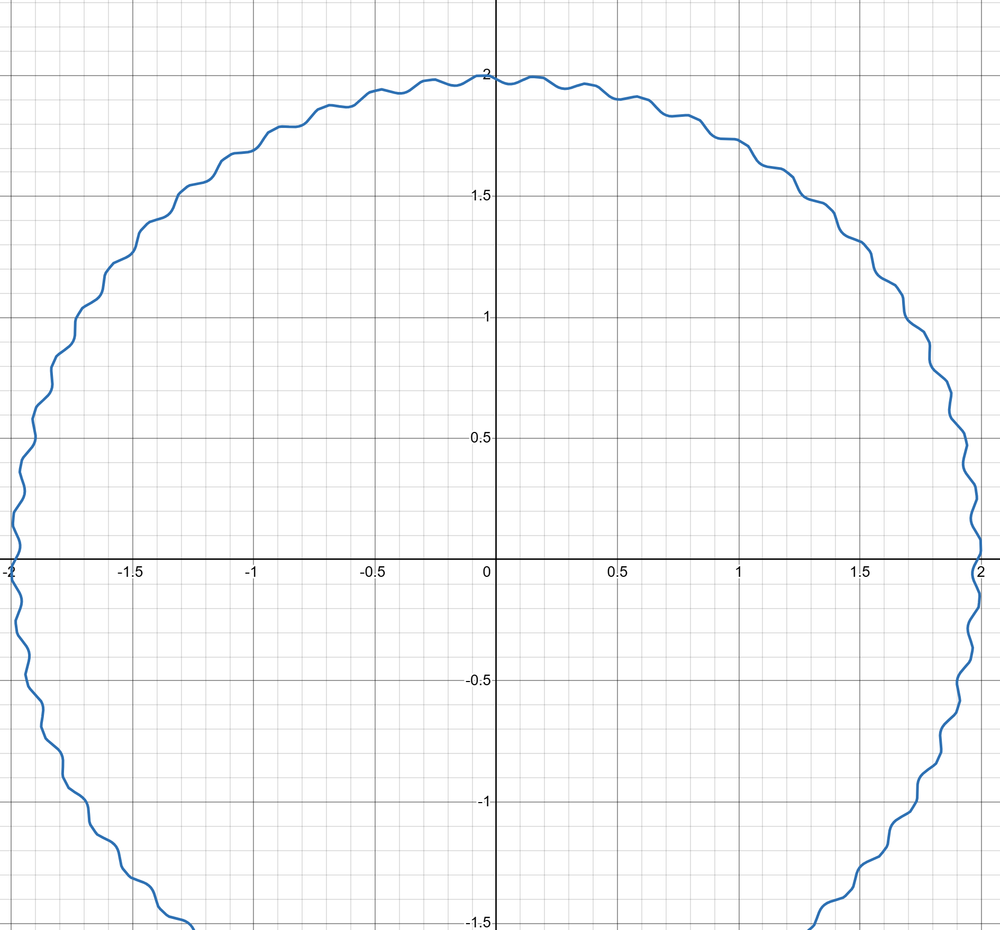

## Exercise 0
 **Contributors:**

 Matrim Cirullo-Nesbitt

 Abhishek Vilekar

 Andrew Gabaldon

***
***
### 0a.)
 Review your project status. What have you been able to accomplish so far? What were you unable to do in the time you had? Be honest in your evaluation of your progress. You will not be penalized for not reaching your milestones. What does that mean you need to prioritize in the coming weeks? (at least 150 words)
***
For our project, to be clear and to have this in writing, we are trying to figure out the effect of dimples on the trajectory of a golf ball, via analysis of the velocity and spin-dependent magnus effect. Our project status is best summarized as such: we have our general plan completed, we know the complexities and difficulties associated with the project, and we have some preliminary work on the easier parts of the project done. I would say, our status is "out of the planning stage, and ready for real research and work". A big milestone we achieved as a part of this (only like two days ago) is figuring out the process that our computation and analysis will have to take. I will explain here:

First, we must set up a sort of wind-tunnel simulation, and sweep through velocities to do a boundary-layer analysis of a dimpled golf ball (and an undimpled sphere for comparison), more specifically, on the surface elements of the ball; we then decompose the forces acting on the total ball into drag(which is one-dimensional here, so analytical), gravity, and the magnus effect force (which is what's left). We then decompose the magnus force into the cross product of angular velocity and velocity, multiplied by some scalar. We mark this scalar in a table corresponding to the velocity. Once the analysis is complete (i.e. we have swept through our velocity values) we interpolate a function from our scalar table, $S(v)$. We then do a very similar analysis as we completed in exercise 1 of Midterm 1, to integrate EoM and acquire a trajectory. We check this trajectory against real ones, and more specifically, our result from exercise 1.

$%after talking with danny, I came to the idea that for the force decomposition, for each velocity step, we could take two cases, of our surface to be spinning, and then of our surface to be stationary, and take the subtraction of the force of the stationary case from the spinning case to be the force of the magnus effect (since the other forces are not spin-dependent and the magnus effect is 0 iff spin is zero). Additionally, Danny brought up the idea that in the boundary layer analysis, a way we can probe the forces on the ball (as a particle method) is by examining the change in momentum vector of some section of air (that we know the properties of) after collision with the surface.$

### 0b.)
 What problems have you encountered in doing you research? What questions came up and how did you resolve them? Are there any unresolved questions? (at least 150 words)
 ***
 A major problem we encountered in our research, and actually something that led us to reduce the scope of our project, was the realization that what we wanted to do (simulating a golf ball's trajectory to the point of near-accuracy with observed trajectories), is that when we initially decided to look at a different approach to the dynamics of the ball, we wanted to do a pressure-field based approach, which would have led us to not only have to generate some solutions to the Navier-Stokes equations (not impossible but computationally non-trivial) but to partake in a series of back-to-back, extremely computationally difficult (at least in Python) calculations. This, we quickly realized, would have been untenable, so we scaled back the scope of the project with some guidance from the midterm 1 feedback. We still were left with a few questions, such as "How do we actually use a force-model to analyze what happens to the ball?", "What forces other than the magnus effect have we not looked at?", "Does a pressure model actually change the specific problem we are trying to solve", and some more questions regarding what, in specific, we are looking to test; a few of which led us to realize that the main parameter we needed to "solve" for in a way that we havent done so before is the $S(v)$ parameter in the equation for the Magnus effect. This then led to the development of some new questions: "Is it possible to isolate the Magnus effect, or specifically the $S(v)$ paramter?", "How can we compute the difference in $S(v)$ at different velocity ranges?", "What methods for simulating the surface of the golf ball (dimples/no dimples), and the interaction of such with air exist?". We solved a few of these with some of the steps mentioned in the outline we give in 0a. We can isolate the magnus effect by using our analysis method in any given velocity-step to compute both a spinning and non-spinning ball, then subtract the no-spin forces from the spinning ball's forces, resulting in strictly the effect of the Magnus effect, which we can decompose into $S(v) (\vec{\omega}\times\vec{v})$, and since in each velocity step, we know $\vec{\omega}$ and $\vec{v}$, we can simply divide out the cross product to get $S(v)$. The remaining, massive open questions are 
 "What boundary-layer analysis methods exist for our purposes, or do we have to create one from scratch?"
 "How are we going to actually model the effect of the ball on the air in the hypothetical wind tunnel experiment, i.e. how are we going to make our simulation's ball affect the momentum of the air around it?"
 and
 "What other simplifications will we have to make for this, and might we have to rely on something like a Reynold's number approximation to simulate the effect of the dimples, to find $S(v)$?"

### 0c.)
 Provide an **updated** artifact from your project. This could be a plot, a code snippet, a data set, or a figure. Explain what this artifact is and how it fits into your project. (at least 150 words)
***
For this section, one of the things we will, for absolute certain, need for an analysis of a dimpled ball is a parametric equation for the surface of the dimpled ball, as we will be integrating over its surface for our analysis. The function and representation of the ball (for verification) will be represented here. I include the code and visualization here, and will include the resources used for reference.

This image is of a polar function that generates a dimpled circle. This represents, quite clearly, the surface of our golf ball we would use in the wind tunnel analysis to find $S(v)$. It isn't exact to the specifications of our ball, as it was created in desmos, but marks some real progress towards our goal of modeling the trajectory here in full detail. On the image, one can see that there are dimples, of course, with sinusoidal walls, and the radius of the ball, outside of the dimples. Importantly, as in real-life golf balls, the ratio of dimpled circumference to undimpled circumference is greater than 50\%, somewhere around 70\%.

### 0d.)
 Update your project timeline and milestones. How will you adjust your timeline to account for the work you have done and the work you have left to do? (at least 150 words)
***
Our project timeline (including milestones) with the current progress we have made regarding research and proof-of-concept goes as follows:

#### Milestone 1 - Wind tunnel simulator
 - Create an 2-D agent-based particle model that simulates collisions and momentum transfer between particles.
 - Adapt this to the situation of a wind tunnel, and allow for starting the simulation with some tunable initial particle settings and placements.
 - Add functionality to keep track of changes in momentum following collisions of groups of like particles.
 - Design a function that can "integrate" these changes over the timespan of the simulation.
#### Milestone 2 - Running $S(v)$ simulations
 - Create a tunable, parametric function that creates an accurate depiction of standard golf balls in 2-D (This is the part that we have some good work on from the artifact).
 - Devise a method to transform the parametric function of the ball into initial particles (probably a mesh or something) in the simulator.
 - Create functionality for the ball to rotate in the simulator (this might be a little tricky)
 - Optimize the ball and simulator so that running it over $n<100$ steps takes less than an hour.
 - Run the simulator, grab our forces, decompose them, and get $S$ values in a table.
#### Milestone 3 - Modeling Trajectory
 - Interpolate $S$ values into $S(v)$ function
 - Get EoM, and integrate
 - Tune for a few different initial parameters, based on the parameters of the real-life trajectories that we find.
 - Visualize and compare to a few different real-life examples, as well as to our exercise 1 for midterm 1 example.